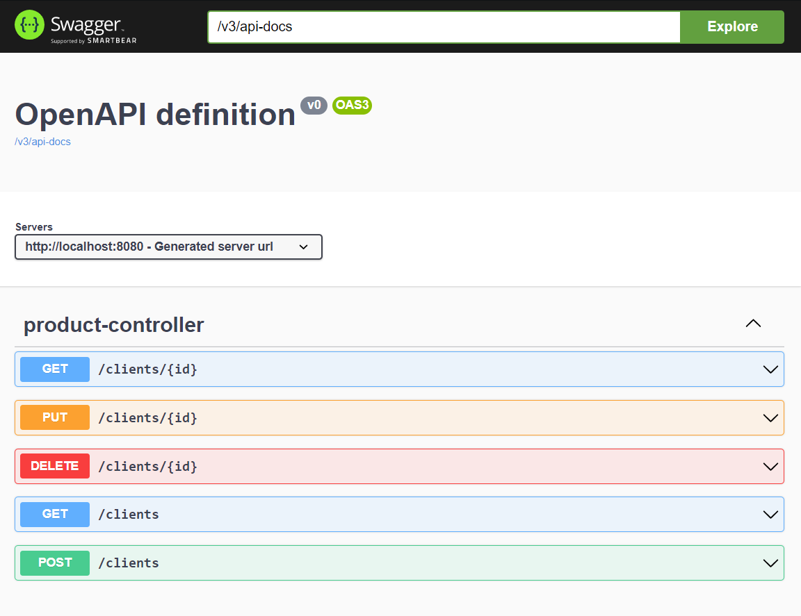

## 💻 Challenge

Create a solution that explores the concept of Design Patterns in practice.

Patterns and concepts presented in the Lab:

- **Singleton**: is a creation design pattern that restricts the instantiation of a class to a singular instance.
- **Strategy**: is a behavioral design pattern that lets you define a family of algorithms, put each of them into a
  separate class, and make their objects interchangeable.
- **Facade**: is a structural design pattern that provides a simplified interface to a library, a framework, or any
  other complex set of classes

## 🚀 How to execute

```ssh
mvn spring-boot:run
```

## ✨ How to use

Access the endpoint to enter into swagger interface:
http://localhost:8080/swagger-ui/index.html

<p align="center">
  
  <br/>
  <span>Figure 1: Swagger API</span>
</p>